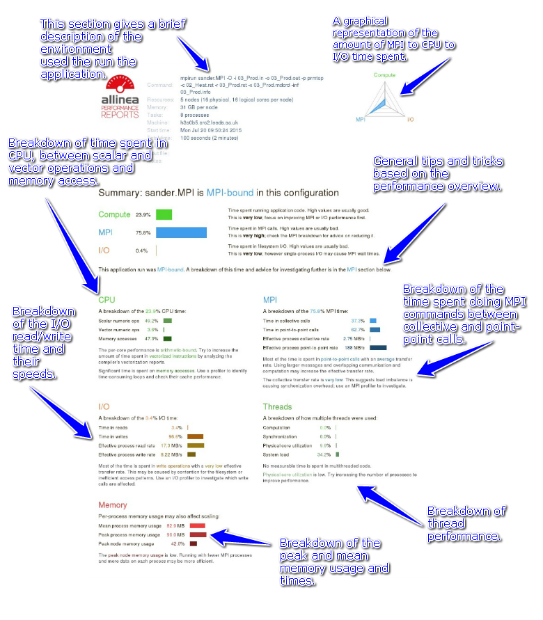

#**Allinea Performance Reports**

##**How to Use**

Running Performance Reports on programs is as easy as adding the command
`perf-report` at the start of what you would normally run. This can
also be done in the job submission script by adding the `perf-report`prefix.

Allinea is installed on ARC1 and ARC2. To use it you will need to run
the `module load allinea` command.

##**OpenFOAM**

OpenFOAM will need to be compiled for profiling as the current OpenFOAM
modules have been built without this feature enabled.

To run Performance Reports with OpenFOAM the `decomposeParDict` should be
altered to specify how the mesh and fields will be decomposed using the
`decomposePar` utility. An example can be found in the
`tutorials/multiphase/interFoam/damBreak` tutorial.

For example running the `interFoam/damBreak` tutorial with 4 processes
should have a `decomposeParDict` dictionary with the following code:
```
numberOfSubdomains 4;
method simple;

simpleCoeffs { 
    n         ( 2 2 1 ); 
    delta     0.001; 
} 
```
Running with 8 process will change the `numberofSubdomains` and the `n`
```
numberOfSubdomains 8; 
method        simple; 

simpleCoeffs 
{ 
    n          ( 4 1 2 ); 
    delta      0.001; 
} 
```
Once the `decomposePar` command has been executed. The performance report
can now be generated by adding `perf-report` followed by the
`mpirun` command then the name of the simulation. The command
`–parallel` needs to be specified for the simulation to run in
parallel.

This is an example of how to run Performance Reports with parallel OpenFOAM:
```
$ perf-report mpirun –np 4 interFoam -parallel
```
##**Gromacs**

To run Performance Reports with Gromacs, it is as simple as adding
`perf-report` at the start followed by `mpirun <mpirun commands>` and then `mdrun_mpi <mdrun commands>`.

Here is an example job submission script for Gromacs that will generate
performance reports:
```
#Gromacs job submission script

#$ -cwd -V

#$ -l h\_rt=00:10:00

#$ -l nodes=4,ppn=8,tpp=1

perf-report mpirun mdrun_mpi -v -deffnm run
```
This job submission script will run Performance Reports on this Gromacs
example on 4 nodes, with 8 processes per node, for a total of 24
processes. For Gromacs, it is necessary to specify the threads per
process `tpp` option to equal 1 as the Gromacs application was built
to only support 1 OpenMP thread for each process.

##**AMBER**

To run Performance Reports with AMBER it is simply a case of placing the
command `perf-report` in front of the normal command to run your
program. For example:
```
mpirun sander.MPI -O –I...
```
To use with Performance Reports, this becomes:
```
perf-report mpirun sander.MPI -O –I...
```
Using Performance Reports with AMBER really is as simple as that. After
the execution has completed you will then have a `.txt` file and a `.html`
file that will both contain the output of you performance report.

##**What Reports Mean?**


In general, high CPU times and low MPI and I/O times are good. This is
because you want to minimize the time spent communicating and
reading/writing, as this is all time where you could potentially be
performing more calculations. This is not always the case, however, and
will depend entirely on the type of problem that your program solves.
Often the optimal solution may have very high MPI times and this may be
unavoidable.

The CPU, MPI, I/O Thread and Memory breakdowns all allow you to gain a
better insight into what your program is spending the most time doing.
If you have a rough idea of what your program should be doing, and the
readings indicate that something wildly different is happening, then it
is likely that something is going wrong somewhere and that more
investigation may be required.

For example, if you know that the only writing your program should do is
produce a single small file and the I/O write percentage is much higher
than expected, then there could be a problem here. This could be caused
by a range of different problems, though one likely cause in this case
could be the file storage system you are using. Depending on the results
of the performance report you will be able to see what might be causing
your problem in your own case.

The reports can be used to find out what is the optimum configuration
and settings to use when submitting a job. There are many different
factors to take in to account for an efficient job submission.

##**Login node vs Compute Nodes**

As you can see below, there is a difference between using the login node
as opposed to using the compute nodes. This Gromacs example ran for 31
seconds on the login node, whereas it ran for 29 seconds on the compute
node. This is because at the login node the resources are shared with
other users on the login node. At the main cluster, the resources are
managed and controlled by the scheduler and the user that has requested
the resource will have exclusive access to the resource for the duration
of the job.

###**Login node**


###**Compute node**


##**Number of Processes**

The number of processes used is a big factor on how well the program
will execute. Performance reports will advise you to use more processes
when the amount of time spent in MPI calls is low.

###**4 Processes**


###**8 Processes**


###**16 processes**


These examples above all use the `nodes, ppn` syntax with only 1 node used.
As you can see the amount of time spent in MPI calls when using 4
processes is only 13.2%. Due to this very low amount, Performance
Reports suggests to use a higher process count as the code may benefit
from this. The MPI call percentage increases as more processes is used.
##**Process Arrangement**

This is another important factor as the arrangements of nodes and
processes used can affect the performance of the run. The placement can
be set by using the `nodes, ppn` syntax in the job submission script.
```
#$ -l nodes=X,ppn=Y
```
**X** = number of nodes  
**Y** = number of processes per node

Where **X**\***Y** = total number of processes to use

The other option is to let the scheduler find the optimum arrangement
and user what processes and nodes are free. This is done by using the
`–pe ib` syntax in the job submission script.
```
#$ -pe ib N
```
**N** = number of processes to be used

By default, jobs will be dispatched to any compute node in the cluster.
The following parameter can be used for a job to be given a better
distribution of nodes:
```
#$ -l placement=optimal
```
This **optimal** option minimises number of switch hops.
```
#$ -l placement=scatter
```
This **scatter** option ignores topology concerns and run anywhere,
potentially introducing more latency than necessary to all
communications.
